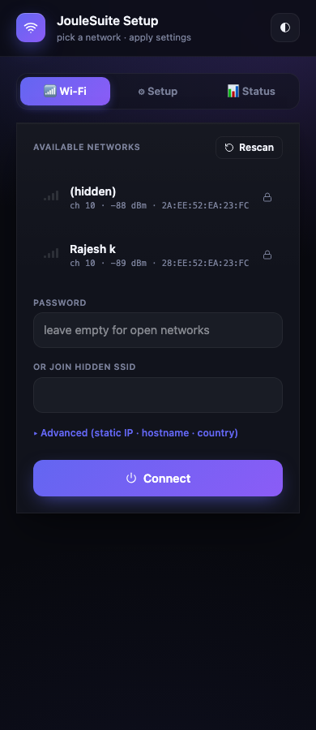

# VectiNet

> Wi-Fi provisioning + network manager for ESP32. Captive portal,
> **multi-SSID failover**, 10 custom-parameter types, static IP, mDNS,
> country code, NVS-backed persistence, live diagnostics.
> Apache-2.0 licensed, mobile-first, **~28 KB on the wire**.


**Author:** [Chinmoy Bhuyan](mailto:chinmoy@joulepoint.com) · **License:** Apache-2.0
· **Targets:** ESP32 (S2 / S3 / C3 / classic)

> **ESP32 only.** Persistence (Preferences/NVS), mDNS and the regulatory
> country code sit on ESP-IDF APIs with no drop-in ESP8266 equivalent, so
> the header `#error`s on other platforms rather than building a device
> that silently forgets its credentials on every reboot.

---

## Features

| | |
|---|---|
| 📶 **Multi-SSID failover** | Save up to 8 networks; on boot they are tried in saved order until one associates |
| 🪤 **Captive portal** | DNS hijack on the SoftAP pops the setup page on every connected device automatically |
| 🎛 **10 custom-parameter types** | `text` · `password` · `number` · `dropdown` · `color` · `toggle` · `textarea` · `display` (read-only) · `header` · `divider` |
| 🪟 **Portal UX shaping** | `setUiDefaultTab()` picks the opening tab, `setUiHideWifiTab()` hides the network picker on AP-only setup appliances |
| 🌐 **Static IP / DHCP / mDNS** | Configurable from the portal or by code |
| 🏷 **Hostname + country code** | Set per device; survives reboots (unless the sketch sets them — see below) |
| 💾 **NVS persistence** | Credentials + parameters in `Preferences`; the network count is written last so a power cut can't leave NVS claiming a slot it doesn't hold |
| 🔒 **Optional HTTP auth** | `setAuth()` closes every `/wifi` route, portal included |
| 🔁 **Reprovision watchdog** | If Wi-Fi stays down longer than your threshold, the portal pops automatically |
| 🩺 **Live diagnostics** | `/wifi/status` JSON returns SSID, IP, gateway, BSSID, RSSI, channel, heap, uptime |
| ⚡ **Non-blocking connect** | `autoConnect()` returns immediately and `loop()` drives the attempts; `blockingConnect(timeout)` for setup() flows |
| 🎨 **Theme aware** | Dark / light / auto; user choice persists |
| 📱 **Mobile-first portal** | 44 px touch targets, viewport-fit safe-area, glass-morphism panels |
| 🪶 **~28 KB on the wire** | Pre-gzipped UI — 28,498 B gzip, 82,969 B raw — served with `Content-Encoding: gzip` |

---

## Quick start

```cpp
#include <WiFi.h>
#include <ESPAsyncWebServer.h>
#include <VectiNet.h>

AsyncWebServer server(80);

void setup() {
  VectiNet.setApCredentials("MyDevice-Setup");
  VectiNet.setHostname("mydevice");
  VectiNet.setMdnsName("mydevice");

  VectiNet.addParameter({"mqtt_host", "MQTT host", vecti::NetParamType::Text,
                         "broker.local", "fqdn or ip", "", 0, 0});
  VectiNet.addParameter({"mqtt_port", "MQTT port", vecti::NetParamType::Number,
                         "1883", "", "", 1, 65535});

  VectiNet.begin(&server);
  server.begin();
  VectiNet.autoConnect();
}

void loop() {
  VectiNet.loop();   // pumps DNS, portal watchdog, reconnect
}
```

First boot: the SoftAP `MyDevice-Setup` comes up at `192.168.4.1`.
Connect a phone → portal opens automatically → pick Wi-Fi → the device
saves the credentials and starts associating on the next `loop()` tick.
No reboot: once the link is up the SoftAP and its DNS hijack are torn
down (so the phone drops off it) and `getState()` reports `Connected`.
Subsequent boots skip the portal.

`loop()` must run for provisioning to progress — a sketch that blocks in
`setup()` will sit in `Connecting` forever.

---

## API reference

### Setup

```cpp
void setApCredentials  (const String &ssid, const String &password = "");
void setHostname       (const String &h);
void setMdnsName       (const String &n);
void setCountryCode    (const String &cc);          // e.g. "US", "IN", "01"
void setBrandColor     (const String &cssColor);
void setTitle          (const String &t);
void setAutoReconnect  (bool on);                   // default true
void setAuth           (const String &user, const String &pass);
void setUiDefaultTab   (const String &tab);         // "wifi" | "params" | "status"
void setUiHideWifiTab  (bool hide);
```

`setUiDefaultTab()` / `setUiHideWifiTab()` shape the portal itself. An AP-only
setup appliance — one whose only network role is hosting this portal, e.g. a
PLC front panel — opens straight on its parameter form and drops the network
picker entirely:

```cpp
VectiNet.setUiDefaultTab("params");
VectiNet.setUiHideWifiTab(true);
```

Both are read by the SPA from `/wifi/status` on first load, so they take
effect without a rebuild of the UI blob.

`setHostname()` / `setMdnsName()` / `setCountryCode()` / `setStaticIP()`
**win over the persisted values** — otherwise a hostname snapshotted into
NVS the first time anyone saved a network would outlive every reflash and
the setter would be a permanent no-op. The trade: on a sketch that
hardcodes one of these, the portal's matching field only lasts until the
next reboot. Leave them unset to let the portal own them.

### Authentication

```cpp
VectiNet.setAuth("admin", "s3cret");   // before begin()
```

**Everything under `/wifi` is unauthenticated until you call this** — the
portal HTML, `/wifi/scan`, `/wifi/status`, and the mutating routes
`/wifi/connect`, `/wifi/params`, `/wifi/reset` and `/wifi/restart`. On a
device reachable from a LAN that means anyone can factory-reset it
(`POST /wifi/reset`) or re-point it at their own AP (`POST /wifi/connect`).
Set credentials on anything that leaves your bench, and give the SoftAP a
password too (`setApCredentials(ssid, pass)`).

With auth on, HTTP Basic covers every `/wifi` route including the portal
page — the browser prompts on the page load and reuses the credentials for
the SPA's own requests. `/wifi/params` never returns a stored `password`
parameter value in either case; an empty password field on save means
"leave it unchanged".

### Timing

```cpp
void setPortalTimeoutMs (uint32_t ms);   // 0 = keep portal up forever
void setConnectTimeoutMs(uint32_t ms);   // default 15000
void setReprovisionMs   (uint32_t ms);   // 0 = never auto-reopen portal
```

### Static IP

```cpp
void setStaticIP(IPAddress ip, IPAddress gw, IPAddress mask, IPAddress dns = (uint32_t)0);
void clearStaticIP();
```

### Credentials

```cpp
bool saveCredentials(const String &ssid, const String &password, bool hidden = false);
void clearAllCredentials();
std::vector<NetCreds> savedNetworks() const;
```

The library keeps up to 8 saved networks in NVS. `autoConnect()` tries
them **in saved order** — one `WiFi.begin()` at a time, each given
`setConnectTimeoutMs()` to associate — and raises the portal when the list
is exhausted. There is no RSSI ranking: put the network you expect first.

`saveCredentials()` returns `false` when all 8 slots are taken; a 9th
network would work until the next reboot and then silently vanish.

Both functions may be called **before** `begin()` — `MultiSSID.ino` seeds its
list that way, and a factory-reset jumper read in `setup()` typically calls
`clearAllCredentials()` there. Either call pulls NVS in first, so:

* the 8-slot budget counts networks already persisted, not just the ones this
  boot has seeded. Seeding onto a device that was provisioned at 8 sites
  returns `false` rather than silently evicting one of them;
* re-seeding an SSID that is already in NVS updates it in place;
* `clearAllCredentials()` really writes `n = 0`, and a later
  `saveCredentials()` starts from an empty list.

`hidden` is stored and round-tripped for the UI, but esp_wifi probes for
the configured SSID either way, so it changes nothing about the join.

### Custom parameters

```cpp
enum class NetParamType : uint8_t {
  Text=0, Password, Number, Toggle, Dropdown, Color, Header, Divider, Textarea,
  Display            // read-only value + copy button; firmware-owned
};

struct NetParam {
  String       key;
  String       label;
  NetParamType type;
  String       value;
  String       hint;
  String       opts;          // dropdown only: "one|two|three"
  int          min = 0, max = 0;   // number only
};

void addParameter(const NetParam &p);
String paramValue(const String &key) const;
```

Parameters render on the **Setup** tab of the portal. Values persist to
NVS (`Preferences` namespace `vectinet`, key `p_<param-key>`). Add them
**before** `begin()`.

`Header`, `Divider` and `Display` are presentation-only: their content is
firmware-owned, recomputed on every boot, and never persisted or written back
by a save. `Display` renders `value` read-only in a monospace box with a
copy button — for a device fingerprint, serial or build id the operator must
read but never edit.

Example covering every type:

```cpp
VectiNet.addParameter({"sec1",   "Application", vecti::NetParamType::Header,  "","","",0,0});
VectiNet.addParameter({"room",   "Room name",   vecti::NetParamType::Text,    "Lab","where is this device?","",0,0});
VectiNet.addParameter({"mqtt_h", "MQTT host",   vecti::NetParamType::Text,    "broker.local","fqdn or ip","",0,0});
VectiNet.addParameter({"mqtt_p", "MQTT port",   vecti::NetParamType::Number,  "1883","","",1,65535});
VectiNet.addParameter({"mqtt_pw","MQTT password",vecti::NetParamType::Password,"","","",0,0});
VectiNet.addParameter({"region", "Region",      vecti::NetParamType::Dropdown,"EU","","EU|US|APAC|other",0,0});
VectiNet.addParameter({"colour", "Accent",      vecti::NetParamType::Color,   "#7c5cff","","",0,0});
VectiNet.addParameter({"verbose","Verbose logs",vecti::NetParamType::Toggle,  "1","","",0,0});
VectiNet.addParameter({"sec2",   "Notes",       vecti::NetParamType::Divider, "","","",0,0});
VectiNet.addParameter({"notes",  "Site notes",  vecti::NetParamType::Textarea,"line 1\nline 2","free-form","",0,0});
VectiNet.addParameter({"fp",     "Device ID",   vecti::NetParamType::Display, deviceFingerprint(),"","",0,0});
```

### Lifecycle

```cpp
void begin           (AsyncWebServer *server);   // mount routes; loads NVS
void autoConnect     ();                         // arm the sweep, return immediately
bool blockingConnect (uint32_t timeoutMs = 20000);
void startPortal     ();
void stopPortal      ();
void resetAndReboot  ();                         // wipe NVS namespace + restart
void loop            ();                         // DNS, connect sweep, watchdog
```

`autoConnect()` does not block: it arms the sweep and `loop()` advances it,
so the sketch keeps running while the radio associates. `blockingConnect
(timeoutMs)` spins `loop()` for you and treats `timeoutMs` as the **whole**
budget, not per network — `false` means "not connected yet", and the sweep
carries on in your own `loop()`.

`onState()` **and** `onConfig()` fire on the Arduino task (from `setup()` or
`loop()`), never on the AsyncTCP task, even when an HTTP request caused the
change. A `/wifi/params` POST answers `200` immediately and only flags the
work; the NVS write and your `onConfig()` land on the next `loop()` tick,
with a snapshot of the parameter list. Same for `/wifi/connect`, which is
why a second connect POST arriving before `loop()` has drained the first is
answered `409 busy` rather than overwriting it.

### Callbacks

```cpp
enum class NetState { Idle, Connecting, Connected, Portal, Failed };

void onState (std::function<void(NetState)> cb);
void onConfig(std::function<void(const std::vector<NetParam>&)> cb);
```

### Status accessors

```cpp
NetState  getState();      // Idle / Connecting / Connected / Portal / Failed
IPAddress localIP();
IPAddress gatewayIP();
IPAddress subnetMask();
IPAddress apIP();
String    bssid();
int       rssi();
uint8_t   channel();
String    activeSsid();
```

---

## HTTP endpoints

All of them are gated by `setAuth()` when it is configured, and all of them
are open when it is not.

| Path | Method | Description |
|---|---|---|
| `/wifi`         | GET  | The portal SPA |
| `/wifi/scan`    | GET  | JSON: visible networks (`ssid`, `rssi`, `ch`, `bssid`, `sec`) from the last scan; refreshes at most every 10 s |
| `/wifi/connect` | POST | `{"ssid":"…","password":"…","hidden":false,"hostname":"…","countryCode":"…","staticIp":"…","gateway":"…","netmask":"…","dns":"…","dhcp":false}` |
| `/wifi/status`  | GET  | JSON diagnostics (see below) |
| `/wifi/params`  | GET  | List of registered parameters (`password` values always empty) |
| `/wifi/params`  | POST | `{"key":"value", …}` to update |
| `/wifi/reset`   | POST | Erase NVS + reboot (answers first, reboots ~300 ms later) |
| `/wifi/restart` | POST | Reboot only |
| `/generate_204`, `/gen_204`, `/hotspot-detect.html`, `/ncsi.txt` | GET | OS captive-portal probes (all serve the portal page) |

`/` is deliberately **not** mounted — it belongs to whichever library the
sketch chose as its primary UI (VectiDash, typically). Browse to `/wifi`.

On `/wifi/connect`: `staticIp` + `gateway` + `netmask` must arrive together
and must all parse, or the whole request is rejected with `400 bad ip` —
persisting a half-parsed address would leave a device that can never
associate again. `dns` is optional and defaults to the gateway. Absent
static fields mean **unchanged**, not "clear"; clearing takes an explicit
`"dhcp": true` — which really does hand the interface back to DHCP, address
and all. Bodies over 4 KB are rejected with `413`, and a second connect POST
arriving before `loop()` has applied the first with `409`.

### `/wifi/status` payload

```json
{
  "title":    "VectiNet · Setup",
  "brand":    "#3da9fc",
  "state":    2,
  "ssid":     "MyNetwork",
  "ip":       "192.168.1.100",
  "gateway":  "192.168.1.1",
  "mask":     "255.255.255.0",
  "dns":      "192.168.1.1",
  "bssid":    "28:EE:52:EA:23:FC",
  "channel":  10,
  "rssi":     -86,
  "hostname": "vecti-demo",
  "mdns":     "vecti-demo.local",
  "mac":      "D0:CF:13:73:0A:B8",
  "heap":     258188,
  "uptime_s": 124,
  "uiDefaultTab": "wifi",
  "uiHideWifi":   false
}
```

`state` is `0=Idle 1=Connecting 2=Connected 3=Portal 4=Failed`.
`title` / `brand` carry `setTitle()` / `setBrandColor()` to the SPA (the HTML
ships pre-gzipped, so there is no server-side templating), and
`uiDefaultTab` / `uiHideWifi` carry the portal UX shaping.

### `/wifi/params` payload

```json
{ "params": [
    { "key":"room",  "label":"Room name", "type":"text",   "value":"Lab",    "hint":"…", "opts":"", "min":0, "max":0 },
    { "key":"notes", "label":"Site notes","type":"textarea","value":"line1\nline2", "hint":"", "opts":"", "min":0, "max":0 },
    …
]}
```

---

## UI walkthrough

The portal has three tabs:

| Tab | Contents |
|---|---|
| **📶 Wi-Fi** | Live network list with signal-bar glyphs (▂▄▆█), lock icon, password field, hidden-SSID input, **Advanced** reveal (hostname / country code / static IP / gateway / netmask), Connect button |
| **⚙ Setup** | Custom-parameter form auto-rendered from `/wifi/params` — every type from the table above |
| **📊 Status** | Live diagnostics from `/wifi/status` (auto-refreshes every 3 s), Restart button, Erase-and-reboot button (red, confirmation) |

Mobile (390 px wide):



---

## NVS schema

Namespace: `vectinet` (Preferences API).

| Key      | Type    | Purpose |
|---|---|---|
| `n`      | uint8   | Count of saved networks (0–8); written **last** on every save |
| `s0`…`s7`| string  | SSID per slot |
| `p0`…`p7`| string  | Password per slot |
| `h0`…`h7`| bool    | Hidden flag per slot |
| `hostname` | string | mDNS hostname |
| `country`  | string | Country code |
| `mdns`     | string | mDNS service name |
| `sta`      | bool   | Static IP enabled? |
| `ip`,`gw`,`mk`,`dn` | uint32 | Static IP block (when sta = true) |
| `p_<key>`  | string | Custom parameter value |

`resetAndReboot()` clears the entire namespace.

Writes are **not** transactional — `Preferences` has no journal, and this
library adds none. Ordering is the only guarantee: because `n` lands after
the slots it describes, a power cut mid-save can cost the network you were
adding, but NVS never ends up claiming a slot whose SSID and password came
from different networks.

---

## Patterns

### Read a saved parameter

```cpp
String mqttHost = VectiNet.paramValue("mqtt_host");
int    port     = VectiNet.paramValue("mqtt_port").toInt();
bool   verbose  = VectiNet.paramValue("verbose") == "1";
```

### Reach the portal even while connected

The portal stays mounted at `/wifi` even after `autoConnect()` succeeds.
Useful for in-field reconfiguration without rebooting:

```bash
# from your laptop on the same LAN
open http://device.local/wifi
```

### React to state changes

```cpp
VectiNet.onState([](vecti::NetState s){
  if (s == vecti::NetState::Connected) {
    setupMqtt();
  } else if (s == vecti::NetState::Portal) {
    showSetupHintOnDisplay();
  }
});
```

### React to parameter changes

```cpp
VectiNet.onConfig([](const std::vector<vecti::NetParam>& params){
  // user saved the Setup tab — re-read what matters
  reconfigureMqtt();
});
```

### Static IP from code

```cpp
VectiNet.setStaticIP(
  IPAddress(192,168,1,200),
  IPAddress(192,168,1,1),
  IPAddress(255,255,255,0),
  IPAddress(1,1,1,1));      // optional DNS
```

### Block until connected (legacy-style)

```cpp
if (!VectiNet.blockingConnect(15000)) {
  // 15 s is the whole budget: the sweep may still be working through the
  // saved list in loop(). Force the portal only if you'd rather stop here.
  Serial.println("Wi-Fi not up yet — opening portal");
  VectiNet.startPortal();
}
```

---

## Captive-portal mechanics

When the portal is up, VectiNet runs a UDP **DNS server on port 53** that
answers every query with the SoftAP's IP. Modern OSes then issue a known
"connectivity probe" URL:

| OS       | Probe URL |
|---|---|
| Android  | `http://connectivitycheck.gstatic.com/generate_204` |
| iOS/macOS| `http://captive.apple.com/hotspot-detect.html` |
| Windows  | `http://www.msftncsi.com/ncsi.txt` |

VectiNet's handlers for these exact paths serve the portal HTML, so the
OS pops the setup screen automatically — no manual "192.168.4.1" needed.

---

## Troubleshooting

| Symptom | Cause | Fix |
|---|---|---|
| `tcpip_api_call ... Invalid mbox` panic on boot | `WiFi.setHostname()` called before lwIP init | The library calls `WiFi.mode(WIFI_STA)` first — make sure you don't call `WiFi.setHostname()` yourself before `VectiNet.begin()` |
| Phone connects to AP but no portal pops | Captive-portal probe blocked by firewall or VPN | Manually browse to `http://192.168.4.1/wifi` |
| Connect button times out | Wrong password or out-of-range network | Watch the Status tab; it shows the live state |
| Saved network never reconnects after router reboot | `setAutoReconnect(false)` set | Re-enable, or call `WiFi.reconnect()` in `loop()` |
| Custom params don't show | `addParameter()` called after `begin()` | Move the calls **before** `begin()` |
| Status tab stays on "connecting" forever | `loop()` isn't running — the connect sweep is driven from there | Call `VectiNet.loop()` every pass; don't block in `setup()` |
| Portal hostname / country reverts after reboot | The sketch calls `setHostname()` / `setCountryCode()`, which win over NVS | Drop the setter and let the portal own the field |
| Network list empty on the first look | The scan is asynchronous; results land a few seconds in | The portal retries by itself, or tap refresh (rescans at most every 10 s) |

---

## Dependencies

* `ESP32Async/ESPAsyncWebServer @ ^3.11.0`
* `ESP32Async/AsyncTCP @ ^3.4.0`
* `bblanchon/ArduinoJson @ ^7.4.0`
* arduino-esp32 core 2.x or 3.x — built and tested against **2.0.17**
  (platform `espressif32 @ 6.13.0`), with ESPAsyncWebServer 3.11.0.

`AsyncURIMatcher::exact()` comes from ESPAsyncWebServer, not the core, and
`_mountHandlers()` depends on it — without it `/wifi` swallows `/wifi/*` and
VectiDash's routes on `/` never get a look-in. **3.11.0 is the only release
verified here**, so that is the declared floor. Earlier 3.x releases may well
carry the matcher; building against one is untested, and the symptom if it
doesn't is `error: 'AsyncURIMatcher' has not been declared` on five lines of
`VectiNet.cpp` with nothing pointing at the version. Lower the floor yourself
if you have confirmed a specific older release.

---

## License

Apache-2.0 — see [LICENSE](LICENSE).

---

<sub>**Author:** Chinmoy Bhuyan · **Email:** chinmoy@joulepoint.com · **(c)** 2026 — Apache-2.0</sub>
